# FlowField 3.0

## Field Operations Orchestration Platform

> **Turn operational requirements into guided, stateful and auditable field workflows.**

FlowField 3.0 is a modular orchestration platform for organizations managing inspections, maintenance, installations, technical audits, asset operations, safety activities and other structured work performed in the field.

It does not simply digitize forms.

**It governs the operational process around them.**

---

## What FlowField Does

FlowField transforms an operational requirement into an executable field workflow.

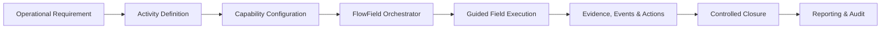

The technician sees only the actions required at that moment.

FlowField manages the process state, dependencies, rules, authorization and audit trail behind the interface.

---

## Why FlowField?

Traditional field operations are often distributed across disconnected tools.

| Typical approach | Common problem |
|---|---|
| Forms and spreadsheets | Inconsistent execution |
| Messaging applications | Decisions become difficult to audit |
| Separate photo repositories | Evidence loses operational context |
| Static checklists | Data is collected, but progression is not governed |
| Manual supervision | High coordination overhead |
| Disconnected systems | Fragmented operational history |

FlowField introduces the missing orchestration layer.

> **Forms collect information. FlowField governs what happens next.**

---

## Stateful Orchestration

FlowField treats each activity as a controlled operational process.

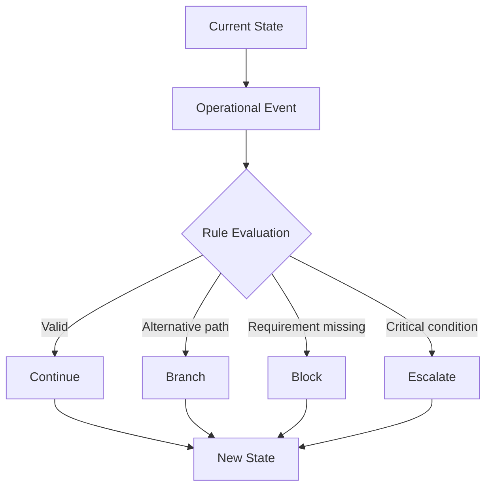

A workflow can:

- require specific evidence
- enforce dependencies
- branch according to field conditions
- block invalid progression
- escalate critical situations
- open corrective actions
- require approval
- prevent closure until requirements are satisfied

---

## Core Capability Architecture

FlowField 3.0 is based on eight reusable capability blocks.

| Module | Responsibility |
|---|---|
| **MOD_CONTEXT** | Operator identity, activity context, site, location and authorization |
| **MOD_SAFETY** | Safety, PPE, operational risk, permits and stop-work conditions |
| **MOD_ASSET** | Asset identification, verification and lifecycle operations |
| **MOD_DATA_CAPTURE** | Photos, video, measurements, notes, checklists and operational evidence |
| **MOD_CRITICALITY** | Detection and classification of anomalies and non-conformities |
| **MOD_DOCUMENTATION** | Formal documents, certificates and compliance records |
| **MOD_ACTIONS** | Corrective actions, ownership, priorities, SLA and remediation |
| **MOD_FLOW** | State, dependencies, branching, blocking, escalation and closure |

Different field activities activate and configure different combinations of these capabilities.

The platform remains reusable.

---

## Clear Responsibility Boundaries

FlowField intentionally keeps operational concepts separate.

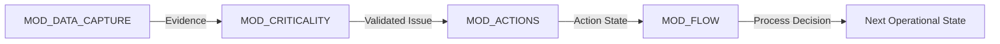

**MOD_DATA_CAPTURE** records what was observed.

**MOD_CRITICALITY** determines whether an operational issue exists.

**MOD_ACTIONS** manages remediation.

**MOD_FLOW** governs what happens next.

---

## Organizational Governance

FlowField also models the people responsible for defining, supervising and executing operational work.

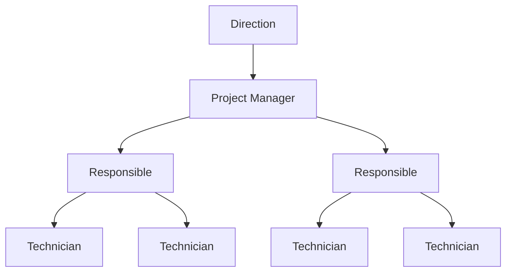

| Role | Primary responsibility |
|---|---|
| **Direction** | Portfolio visibility, KPI, audit, compliance and governance |
| **Project Manager** | Activity definition, planning, configuration and control |
| **Responsible** | Team supervision, assignments, corrective actions, escalation and validation |
| **Technician** | Guided field execution and evidence collection |

FlowField therefore controls two things simultaneously:

> **What can happen next — and who is allowed to make it happen.**

---

## Role + Scope + Workflow

Authorization is not based only on a job title.

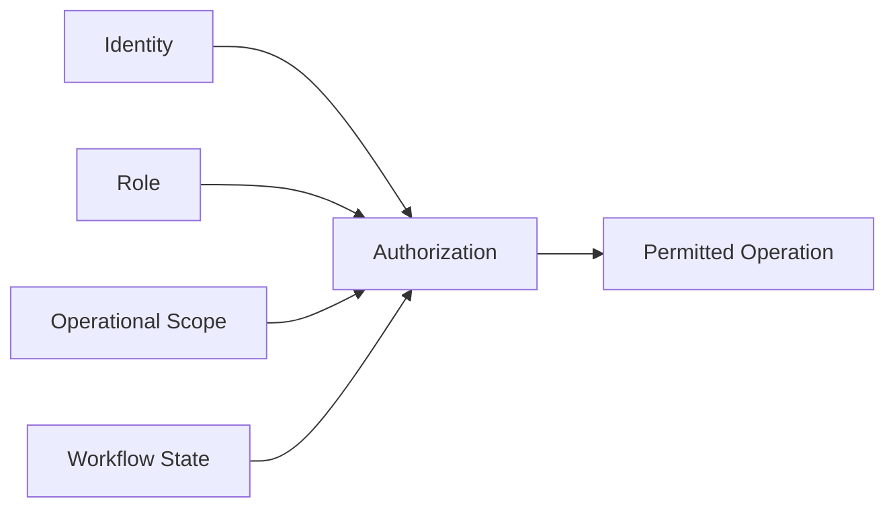

A user can therefore be limited by:

- organization
- project
- team or area
- site
- activity type
- workflow state
- assigned responsibility

Exact permissions remain deployment-specific.

---

## Web + Mobile Experience

FlowField separates governance from field execution.

| Web Workspace | Mobile Field Experience |
|---|---|
| Activity definition | Assigned activities |
| Workflow configuration | Current permitted task |
| Planning | Check-in and access |
| Assignments | Safety execution |
| Monitoring | Asset identification |
| Escalation management | Evidence capture |
| Validation | Measurements |
| Reporting | Issue reporting |

### Web Workspace

Primarily designed for:

**Direction · Project Managers · Responsibles**

### Mobile Field Client

Primarily designed for:

**Technicians · Inspectors · Field Operators**

The technician does not design the workflow.

**The technician executes it.**

---

## AI-Assisted, Not AI-Dependent

Artificial intelligence is separated from the deterministic orchestration core.

| AI Layer | FlowField Core |
|---|---|
| Interpret | Validate |
| Assist | Authorize |
| Suggest | Transition |
| Analyze | Block |
| Summarize | Escalate |
| Support classification | Authorize closure |

> **AI contributes intelligence. FlowField retains operational authority.**

Critical process decisions can remain deterministic, reproducible and auditable.

---

## Edge-First AI Architecture

The reference AI integration uses **Outy**, the edge-oriented AI layer developed within the CashOut ecosystem.

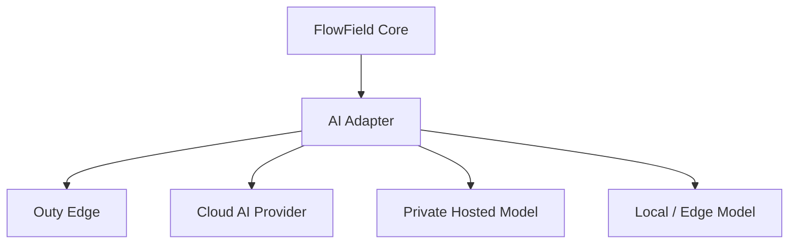

Outy is the reference integration.

It is **not a mandatory dependency** of FlowField.

The orchestration engine remains unchanged when the AI provider changes.

---

## Provider-Agnostic AI

FlowField can integrate with different inference environments:

- Outy
- cloud AI APIs
- private hosted models
- enterprise AI gateways
- local inference servers
- edge AI systems
- customer-managed AI infrastructure

Provider-specific behavior remains behind the AI adapter boundary.

---

## Visual Intelligence / VLM

Photographs captured by field technicians can be analyzed using Vision-Language Models.

The current reference implementation can use a **GPT-based cloud vision API**.

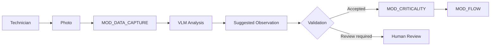

Visual AI can assist with:

- identifying visible components
- reviewing equipment condition
- supporting anomaly detection
- checking installation conditions
- comparing expected and observed states
- assisting technical review

The original photograph remains the operational evidence.

The VLM result is a **derived interpretation**.

---

## Cloud Today, Edge When Appropriate

Visual inference can use cloud or local infrastructure.

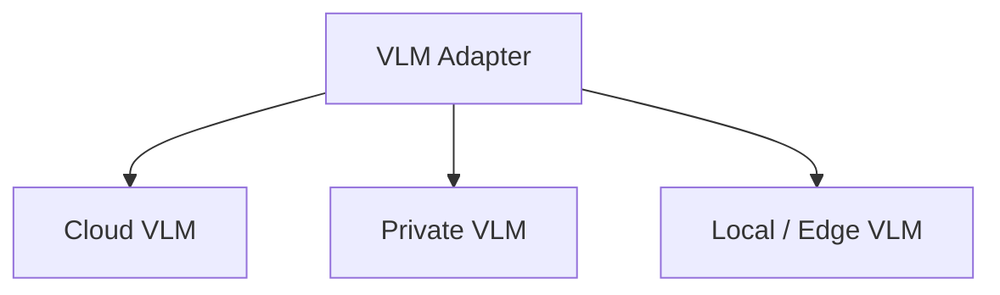

Cloud inference is useful when local hardware cannot efficiently run a suitable vision model.

Where sufficient compute is available, the same architecture can move VLM inference to a private or edge environment.

**The workflow does not change.**

---

## Human-in-the-Loop

AI-generated observations do not automatically inherit operational authority.

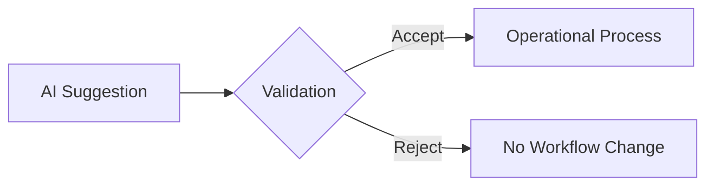

Validation can depend on:

- operational risk
- user role
- activity type
- workflow policy
- customer requirements

This makes AI useful without making operational governance dependent on probabilistic output.

---

## Evidence-Driven Execution

FlowField can work with structured field evidence including:

- photographs
- video
- audio
- technical measurements
- checklists
- notes
- graphical annotations
- formal documents
- signatures
- timestamps
- geolocation
- asset identifiers

Evidence can participate directly in workflow validation.

A workflow can therefore refuse progression or closure when required evidence is missing.

---

## Example — Utility Infrastructure Inspection

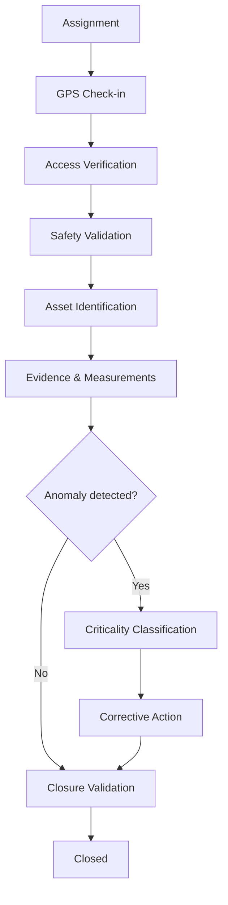

The technician experiences one guided inspection.

Internally, FlowField coordinates context, safety, assets, evidence, criticalities, actions and closure.

---

## Example — Construction Site Inspection

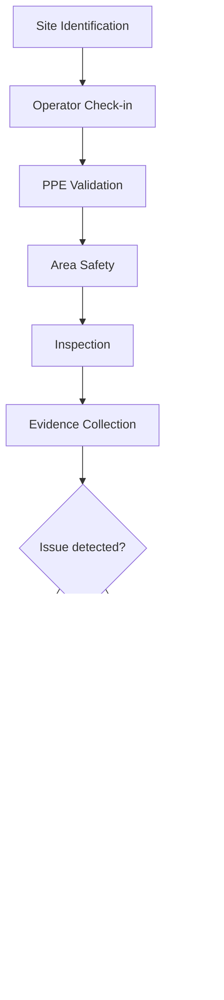

---

## Example — Industrial Maintenance

A maintenance workflow may coordinate:

1. Work assignment
2. Technician check-in
3. Safety validation
4. Equipment identification
5. Initial condition
6. Maintenance operation
7. Before/after evidence
8. Final validation
9. Controlled closure

If the final condition is invalid, FlowField can branch toward remediation or escalation instead of allowing the workflow to close incorrectly.

---

## Designed for Multiple Industries

| Domain | Representative activities |
|---|---|
| **Utilities** | Infrastructure inspection |
| **Energy** | Asset verification and maintenance |
| **Telecommunications** | Installation and network field operations |
| **Construction** | Site inspection and safety controls |
| **Railway** | Infrastructure and compliance audits |
| **Industrial Maintenance** | Equipment service and remediation |
| **Engineering** | Technical surveys |
| **Safety & Compliance** | Controlled inspection and evidence collection |

> **Different industries. Different workflows. One orchestration architecture.**

---

## Enterprise Integration

FlowField can operate between field execution and existing enterprise platforms.

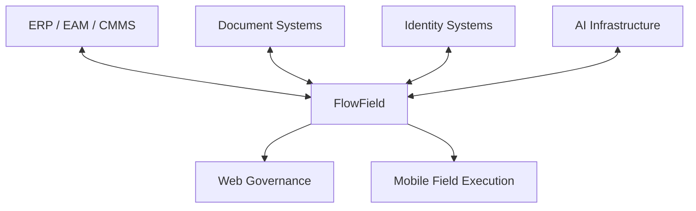

Potential integration areas include:

- ERP
- EAM
- CMMS
- asset platforms
- identity systems
- document systems
- reporting tools
- enterprise APIs
- AI infrastructure

---

## Deployment Flexibility

FlowField can support different deployment strategies.

| Model | Description |
|---|---|
| **Cloud** | Centralized platform and AI services |
| **Private** | Customer-controlled infrastructure |
| **Hybrid** | Central orchestration with private or local components |
| **Edge-oriented** | Operational or AI services positioned closer to field execution |

The deployment model can evolve without redesigning the operational workflow model.

---

## Public Architecture

This repository is the public showcase and reference architecture for FlowField 3.0.

It demonstrates:

- product positioning
- orchestration principles
- reusable capabilities
- organizational governance
- workflow concepts
- AI architecture
- visual intelligence
- representative industry scenarios

The public repository intentionally does **not** expose:

- proprietary orchestration rules
- complete internal schemas
- full internal event catalogs
- customer-specific workflows
- production credentials
- private integrations
- production infrastructure
- commercial implementation details

---

## Documentation

Explore the FlowField 3.0 public reference architecture:

| Document | Purpose |
|---|---|
| [Product Overview](docs/product-overview.md) | Product positioning, operating model, AI and deployment strategy |
| [Architecture](docs/architecture.md) | Core orchestration architecture and design principles |
| [Capability Modules](docs/modules.md) | The eight reusable capability blocks |
| [Workflow Model](docs/workflow-model.md) | States, events, conditions, branching, blocking and closure |
| [Roles and Governance](docs/roles-and-governance.md) | Direction, Project Manager, Responsible and Technician |
| [Industry Use Cases](docs/use-cases.md) | Representative field operation scenarios |

### Recommended Reading

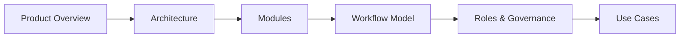

---

## Project Status

**FlowField 3.0 — Active Development**

### Public Showcase Roadmap

- [x] Product overview
- [x] Architecture documentation
- [x] Capability module overview
- [x] Workflow model
- [x] Roles and governance model
- [x] Industry use cases
- [x] Edge-first AI architecture
- [x] Provider-agnostic AI model
- [x] VLM / visual evidence architecture
- [x] Product identity and hero artwork
- [ ] Architecture visual
- [ ] Web workspace mockup
- [ ] Mobile field workflow mockup
- [ ] Interactive demonstration

---

## Commercial Direction

FlowField is designed for commercial deployment through models such as:

- enterprise licensing
- private deployments
- pilot programs
- proof-of-concept projects
- custom integrations
- industry-specific configurations
- implementation services
- support and maintenance

A deployment can begin with one high-value operational workflow and expand progressively across the organization.

---

# FlowField 3.0

### Field Operations Orchestration Platform

> **Define the activity. Orchestrate the process. Guide the field. Interpret the evidence. Preserve the audit trail.**

**Public Showcase · Reference Architecture · Active Development**
