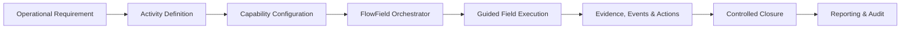
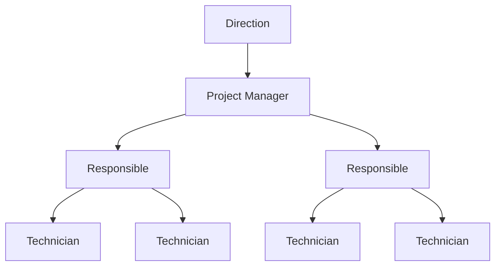
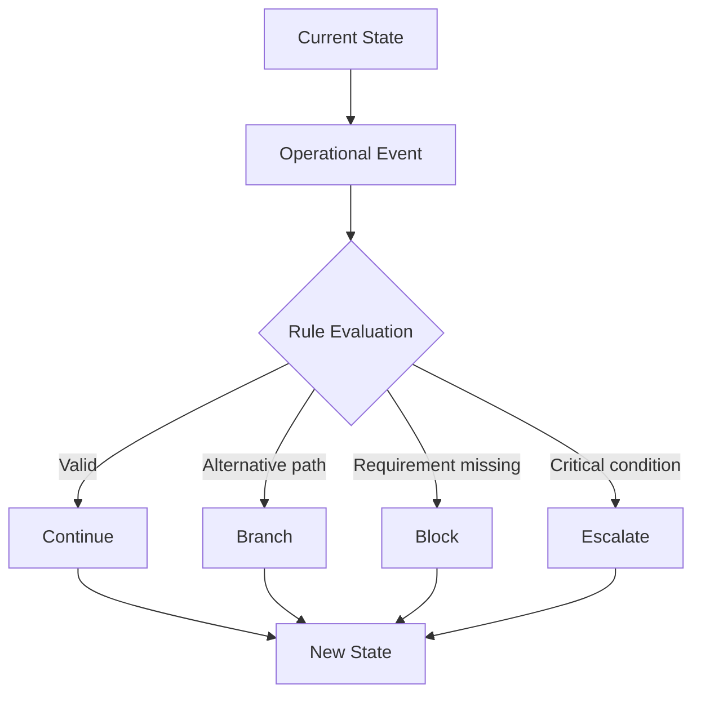
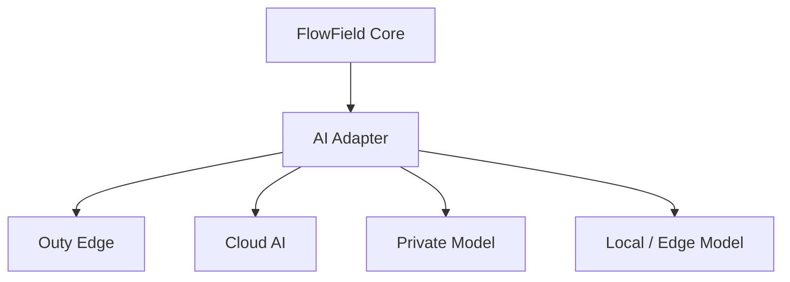
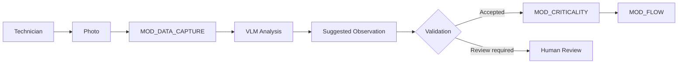
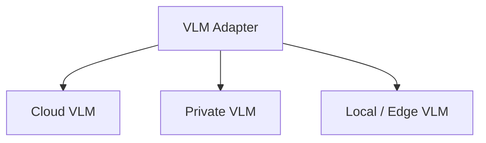
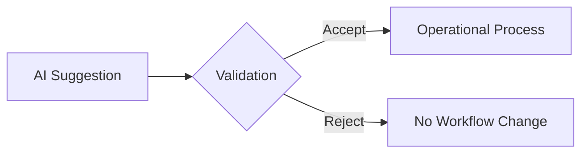
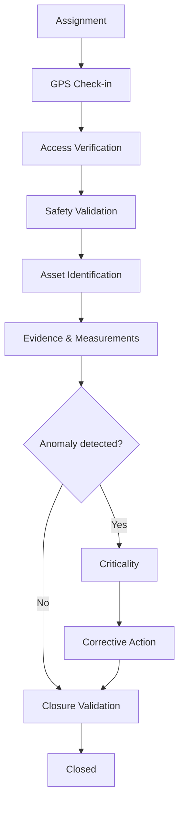
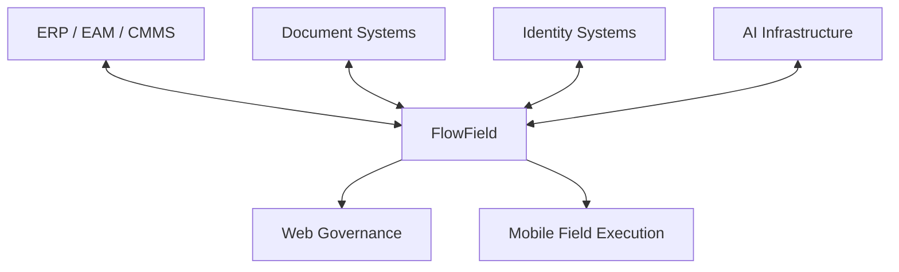

# FlowField 3.0

## Field Operations Orchestration Platform

> **Turn operational requirements into guided, stateful and auditable field workflows.**

FlowField 3.0 is designed for organizations managing inspections, maintenance, installations, technical audits, asset operations, safety activities and other structured work performed in the field.

Rather than digitizing another checklist, FlowField orchestrates the **process around the work**.

---

## The Problem

Field operations are often fragmented across multiple tools and communication channels.

| Typical environment | Operational consequence |
|---|---|
| Forms and spreadsheets | Inconsistent execution |
| Messaging applications | Decisions become difficult to audit |
| Photographs stored separately | Evidence loses operational context |
| Manual supervision | High coordination overhead |
| Disconnected systems | Information becomes fragmented |
| Static checklists | The system records data but does not govern progression |

Digitizing a form does not necessarily digitize the operational process.

**FlowField adds the orchestration layer between requirements and execution.**

---

## How FlowField Works

The technician receives a simple guided experience.

The platform manages the state, rules, dependencies, authorization and audit trail behind it.

---

## Core Capabilities

FlowField 3.0 is composed of eight reusable capability blocks.

| Module | Responsibility |
|---|---|
| **MOD_CONTEXT** | Identity, activity context, site, location and authorization |
| **MOD_SAFETY** | Safety, PPE, risk, permits and stop-work conditions |
| **MOD_ASSET** | Asset identification, verification and lifecycle operations |
| **MOD_DATA_CAPTURE** | Photos, video, measurements, notes, checklists and field evidence |
| **MOD_CRITICALITY** | Detection and classification of anomalies and non-conformities |
| **MOD_DOCUMENTATION** | Formal documents, certificates and compliance records |
| **MOD_ACTIONS** | Corrective actions, ownership, priorities, SLA and remediation |
| **MOD_FLOW** | State, dependencies, branching, blocking, escalation and closure |

Different activities activate and configure different combinations of these capabilities.

The platform remains the same.

---

## Organizational Governance

FlowField separates **process orchestration** from **organizational authority**.

### Direction

Focuses on organizational governance:

- portfolio visibility
- operational KPIs
- SLA
- compliance
- criticalities
- audit
- escalation oversight

### Project Manager

Controls projects and activity configuration:

- Activity Types
- workflow configuration
- planning
- assignments
- monitoring
- exceptions
- reporting

### Responsible

Supervises operational execution:

- technician coordination
- assigned activities
- blocked workflows
- criticalities
- corrective actions
- escalations
- validation

### Technician

Executes field work:

- assigned activities
- guided tasks
- safety controls
- asset operations
- measurements
- evidence collection
- anomaly reporting
- permitted closure actions

> **FlowField controls both what can happen next and who is allowed to make it happen.**

---

## Web + Mobile Operating Model

FlowField provides different experiences according to operational responsibility.

| Web Workspace | Mobile Field Experience |
|---|---|
| Activity definition | Assigned work |
| Workflow configuration | Current permitted task |
| Planning | Check-in and access |
| Assignments | Safety execution |
| Monitoring | Asset identification |
| Escalation management | Evidence capture |
| Validation | Measurements |
| Reporting | Issue reporting |

### Web

The web environment is primarily designed for **Direction, Project Managers and Responsibles**.

### Mobile

The mobile environment is primarily designed for **Technicians and Field Operators**.

The technician does not design the workflow.

**The technician executes it.**

---

## Stateful Orchestration

FlowField does not treat an activity as a static sequence of forms.

An operational event can change what is allowed to happen next.

This allows activities to react to real field conditions rather than assuming that every operation follows the happy path.

---

## Evidence-Driven Operations

Evidence is not simply attached to an activity.

It can participate in workflow validation.

FlowField can work with:

- photographs
- video
- audio
- technical measurements
- checklists
- notes
- graphical annotations
- formal documents
- signatures
- timestamps
- geolocation
- asset identifiers

For example, a workflow can require specific evidence before allowing progression or closure.

---

## AI-Assisted, Not AI-Dependent

FlowField separates artificial intelligence from the deterministic orchestration core.

| AI Layer | FlowField Core |
|---|---|
| Interpret | Validate |
| Assist | Authorize |
| Suggest | Transition |
| Analyze | Block |
| Summarize | Escalate |
| Support classification | Authorize closure |

> **AI contributes intelligence. FlowField retains operational authority.**

This keeps critical workflow decisions reproducible and auditable.

---

## Edge-First AI

The reference AI integration uses **Outy**, the edge-oriented AI layer developed within the CashOut ecosystem.

Outy is the reference implementation, not a mandatory dependency.

The AI provider can change without replacing the FlowField orchestration engine.

---

## Provider-Agnostic AI

FlowField can integrate with different inference environments, including:

- Outy
- cloud AI APIs
- private hosted models
- enterprise AI gateways
- local inference servers
- edge models
- customer-managed AI infrastructure

Provider-specific behavior remains behind the AI adapter boundary.

---

## Visual Intelligence

Field photographs can be analyzed using Vision-Language Models.

The current reference implementation can use a **GPT-based cloud vision API**.

The VLM can assist with tasks such as:

- identifying visible elements
- reviewing equipment condition
- supporting anomaly detection
- checking visible installation conditions
- comparing expected and observed states
- assisting technical review

### Evidence remains evidence

The original photograph remains the primary operational evidence.

The VLM result is stored as a **derived interpretation**.

This distinction preserves traceability.

---

## Cloud or Edge Vision

The vision layer follows the same provider-agnostic architecture.

Cloud inference can be used when local hardware is limited.

Local or edge inference can be adopted when the deployment environment provides sufficient compute.

The workflow model does not change.

---

## Human-in-the-Loop

AI-generated observations do not automatically inherit operational authority.

Validation can depend on:

- operational risk
- workflow policy
- user role
- activity type
- customer requirements

This makes AI useful without making workflow governance dependent on probabilistic output.

---

## Example: Utility Inspection

One workflow can coordinate context, safety, assets, evidence, anomalies, remediation and closure without exposing that complexity to the technician.

---

## Example: Industrial Maintenance

A maintenance workflow can coordinate:

1. Work assignment
2. Technician check-in
3. Safety validation
4. Equipment identification
5. Initial condition
6. Maintenance operation
7. Before/after evidence
8. Final validation
9. Controlled closure

If the final condition is invalid, FlowField can keep the workflow open, branch toward corrective action or escalate according to configured policy.

---

## Designed for Multiple Industries

FlowField's capability architecture can support environments such as:

| Industry / Domain | Example Activities |
|---|---|
| Utilities | Infrastructure inspections |
| Energy | Asset verification and maintenance |
| Telecommunications | Installations and network field operations |
| Construction | Site inspections and safety controls |
| Railway | Infrastructure and compliance audits |
| Industrial maintenance | Equipment service and remediation |
| Engineering | Technical surveys |
| Safety & compliance | Controlled inspections and evidence collection |

**Different industries. Different workflows. One orchestration architecture.**

---

## Enterprise Integration

FlowField can operate between field execution and existing enterprise platforms.

Potential integration categories include:

- ERP
- EAM
- CMMS
- asset systems
- identity providers
- document platforms
- reporting tools
- enterprise APIs
- AI infrastructure

Specific connectors remain deployment-dependent.

---

## Deployment Models

### Cloud

Centralized deployment for organizations with reliable connectivity.

### Private Infrastructure

Deployment inside customer-controlled environments.

### Hybrid

Central services combined with private or edge components.

### Edge-Oriented

Operational or AI capabilities positioned closer to the field environment.

FlowField's architecture allows the deployment model to evolve without redesigning the operational workflow model.

---

## Why FlowField?

FlowField combines capabilities that are often implemented as separate systems:

| Capability | FlowField |
|---|:---:|
| Guided field execution | ✓ |
| Stateful orchestration | ✓ |
| Structured evidence | ✓ |
| Organizational governance | ✓ |
| Corrective action lifecycle | ✓ |
| Auditability | ✓ |
| Edge AI integration | ✓ |
| Provider-agnostic AI | ✓ |
| Vision / VLM support | ✓ |
| Human validation | ✓ |

The goal is not simply to digitize forms.

The goal is to make field operations **controlled, repeatable, traceable and easier to execute**.

---

## Product Positioning

> ### FlowField 3.0
> **A field operations orchestration platform that turns operational requirements into guided, stateful and auditable workflows.**

FlowField combines:

**Deterministic orchestration · Reusable capabilities · Organizational governance · Edge/cloud AI · Visual intelligence · Human validation**

---

## Commercial Direction

FlowField is designed for commercial deployment through models such as:

- enterprise licensing
- private deployments
- proof-of-concept projects
- pilot programs
- custom integrations
- industry-specific configurations
- implementation services
- support and maintenance

A deployment can begin with one operational workflow and expand progressively across the organization.

---

## Public Repository Scope

This repository presents the public product model and reference architecture of FlowField 3.0.

The following remain intentionally outside the public repository:

- proprietary orchestration rules
- complete internal schemas
- full event catalogs
- customer-specific workflows
- private integrations
- production infrastructure
- credentials
- commercial implementation details

---

## Explore the Architecture

- [Architecture](architecture.md)
- [Capability Modules](modules.md)
- [Workflow Model](workflow-model.md)
- [Roles and Governance](roles-and-governance.md)
- [Industry Use Cases](use-cases.md)

---

## FlowField 3.0

**Field Operations Orchestration Platform**

> **Define the activity. Orchestrate the process. Guide the field. Interpret the evidence. Preserve the audit trail.**
